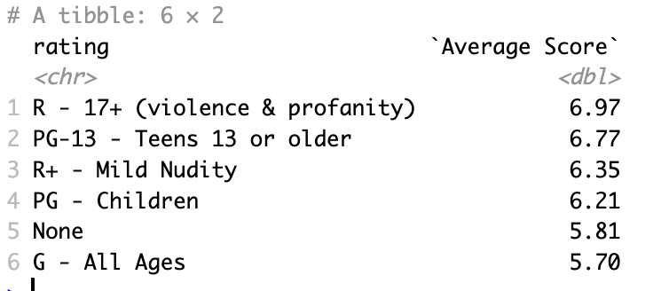
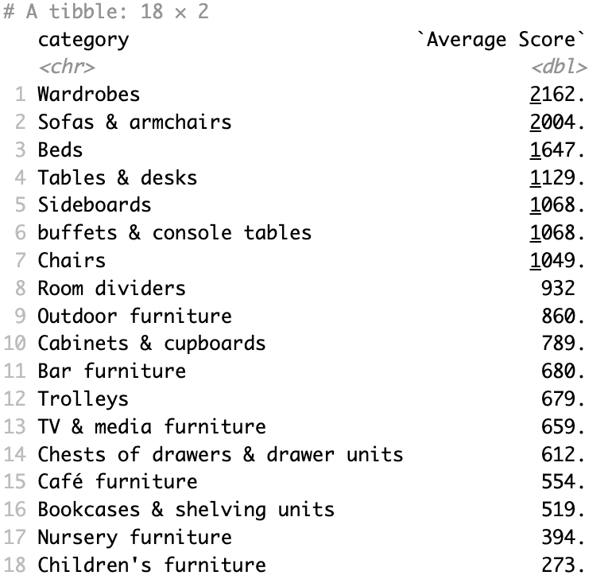
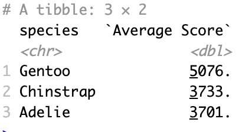
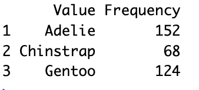

["animeR"](https://github.com/ETC5523-2023/rpkg-justin-git01) R-package information

The R package animeR provides a collection of commonly used univariate and multivariate time series forecasting models including exponential smoothing via state space models and automatic ARIMA modelling. These models work within the fable framework, which provides the tools to evaluate, visualise, and combine models in a workflow consistent with the tidyverse.

### Installation

You can install the stable version from CRAN:

```r
install.packages("animeR")
```

You can install the **development** version from [GitHub](https://github.com/ETC5523-2023/rpkg-justin-git01)

``` r
# install.packages("remotes")
remotes::install_github("https://github.com/ETC5523-2023/rpkg-justin-git01")
```

### Package goals
This package allows user to investigate further on [anime dataset](https://github.com/rfordatascience/tidytuesday/tree/master/data/2019/2019-04-23) from tidytuesday, such as analyzing and visualizing anime data.

### Example

* Functions can be used with built-in data such as anime or ikea
``` r
library(animeR)
what_ave(anime, rating, score)
```



```r
library(animeR)
what_ave(ikea, category, price)
```



* But it can also be used with external data

```r
library(animeR)
library(palmerpenguins)
what_ave(penguins, species, body_mass_g)
```



```r
five_stat(penguins$species)
```



More information about using the animeR package can be found in the [*pkgdown site*](https://rpackage-animer.netlify.app/).
